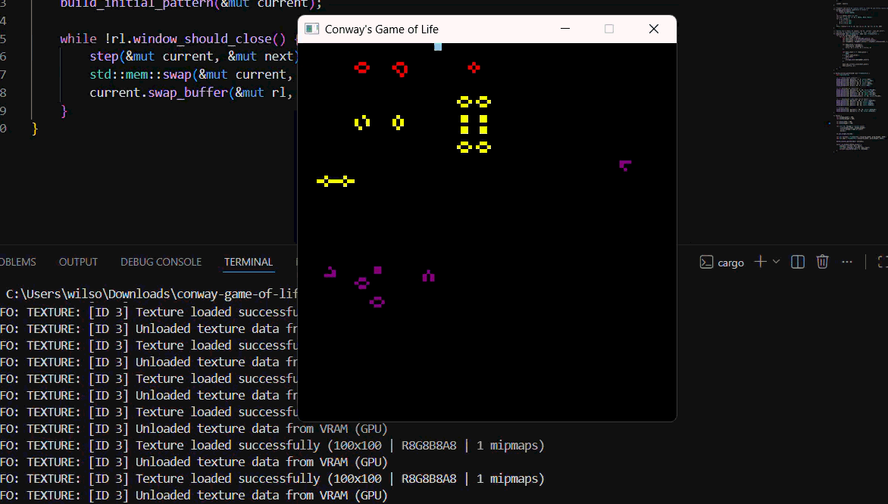

# Conway's Game of Life

Implementación del algoritmo de Conway en Rust usando [raylib](https://www.raylib.com/), a través de un framebuffer propio construido únicamente sobre dos primitivas: `point` (escritura de pixel) y `get_color` (lectura de pixel).


## Reglas implementadas

1. Una célula viva con menos de 2 vecinas vivas muere (subpoblación).
2. Una célula viva con 2 o 3 vecinas vivas sobrevive.
3. Una célula viva con más de 3 vecinas vivas muere (sobrepoblación).
4. Una célula muerta con exactamente 3 vecinas vivas nace (reproducción).

Bordes toroidales (wraparound): las naves espaciales que cruzan un borde reaparecen en el lado opuesto.

## Patrón inicial

- **Still lifes:** Block, Bee-hive, Loaf, Boat, Tub
- **Osciladores:** Blinker, Toad, Beacon, Pulsar, Pentadecathlon
- **Spaceships:** Glider, LWSS, MWSS, HWSS

Cada categoría tiene un color distinto. Las células que sobreviven conservan su color; las que nacen toman el color promedio de sus vecinas vivas.

## Estructura del proyecto

src/
├── main.rs # loop principal, reglas de Conway, patrón inicial
├── framebuffer.rs # framebuffer (point / get_color / swap_buffer)
└── organisms.rs # coordenadas de los patrones clásicos


## Requisitos

- [Rust](https://rustup.rs)
- Toolchain de C++ (Visual Studio Build Tools en Windows) para compilar `raylib`

## Ejecución

```powershell
cargo run --release
```

## Personalización

| Cambiar | Dónde |
|---|---|
| Colores por organismo | `Color::X` en cada `place_pattern(...)` dentro de `build_initial_pattern` (`main.rs`) |
| Velocidad de la animación | `rl.set_target_fps(10)` en `main()` (`main.rs`) |
| Tamaño de la grilla / ventana | `grid_width`, `grid_height`, `window_width`, `window_height` en `main()` (`main.rs`) |
| Bordes toroidales vs. bordes muertos | `WRAP_EDGES` (`main.rs`) |
| Formas de organismos | `organisms.rs` |

## Repositorio

https://github.com/HipWilson/conway-game-of-life

## Funcionamiento


